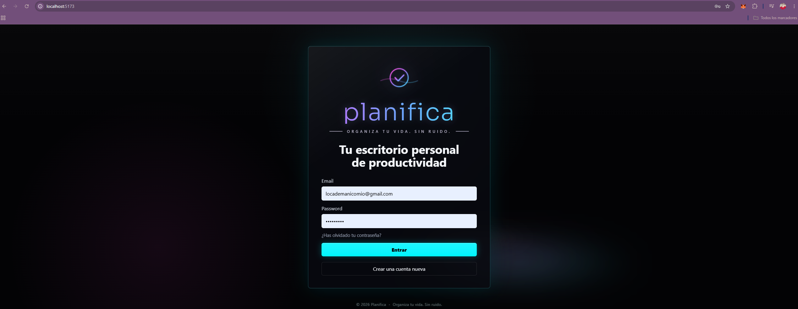
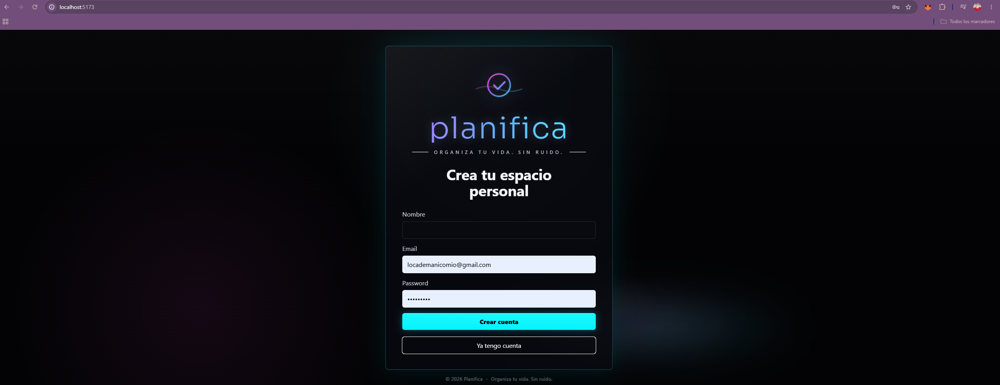
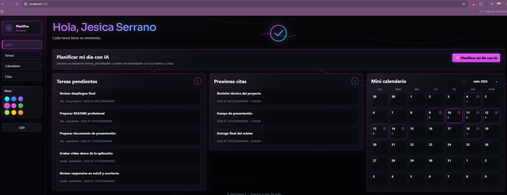
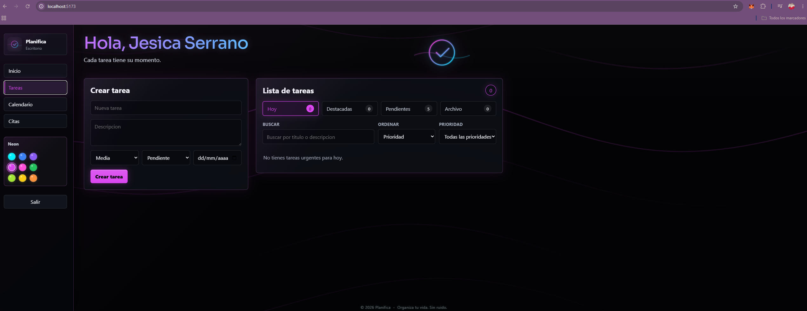
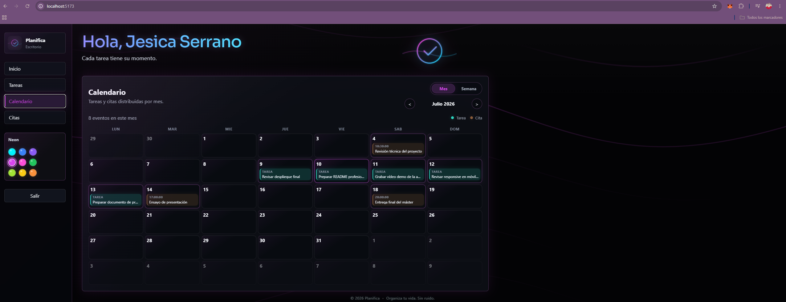
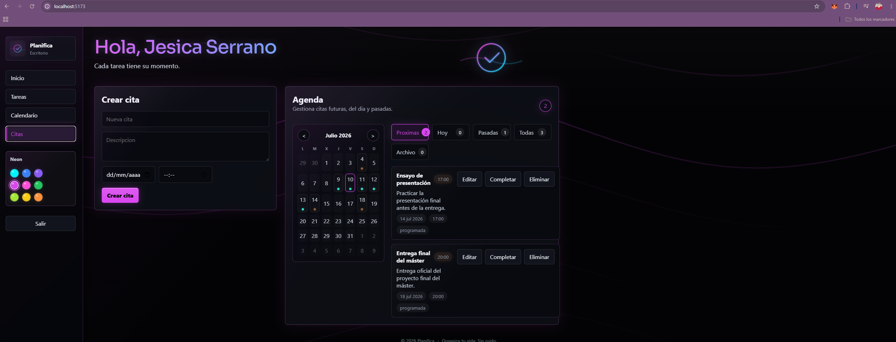
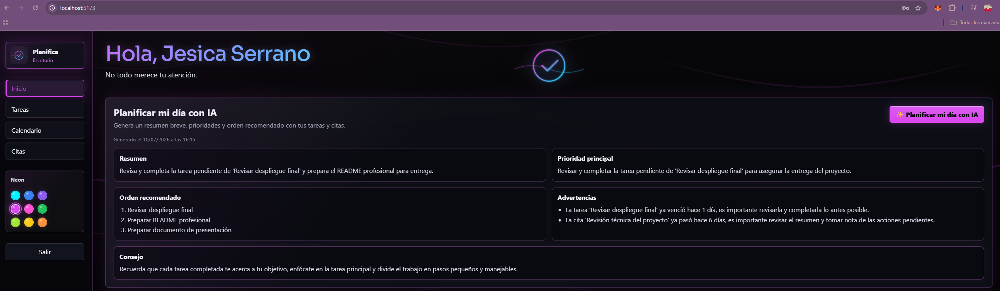

# ✨ Planifica

> Organiza tu vida. Sin ruido.

Aplicación Full Stack de productividad desarrollada con React, Node.js, Express y PostgreSQL que centraliza tareas, citas y calendario en un único espacio de trabajo.

Incluye un asistente de Inteligencia Artificial que analiza el contexto del usuario y genera un enfoque breve del día para ayudar a priorizar lo realmente importante.

**Stack tecnológico:** React · Vite · Node.js · Express · PostgreSQL · JWT · Groq AI

## Información

| Campo | Detalle |
|---|---|
| Tipo | Aplicación Full Stack |
| Estado | Proyecto entregado |
| Frontend | React + Vite |
| Backend | Node.js + Express |
| Base de datos | PostgreSQL |
| IA | Groq API |
| Responsive | Sí |
| Uso | Proyecto final del Máster de Programación e Inteligencia Artificial |

## Índice

- [Información](#información)
- [¿Por qué nace Planifica?](#por-qué-nace-planifica)
- [Capturas](#capturas)
- [Características](#características)
- [Uso de IA](#uso-de-ia)
- [Arquitectura](#arquitectura)
- [Tecnologías utilizadas](#tecnologías-utilizadas)
- [Despliegue](#despliegue)
- [Variables de entorno](#variables-de-entorno)
- [Instalación local](#instalación-local)
- [Base de datos](#base-de-datos)
- [Scripts disponibles](#scripts-disponibles)
- [Seguridad](#seguridad)
- [Estado del proyecto](#estado-del-proyecto)
- [Mejoras futuras](#mejoras-futuras)
- [Reflexión personal](#reflexión-personal)
- [Autora](#autora)
- [Contribuciones](#contribuciones)
- [Licencia](#licencia)

## Badges


## ¿Por qué nace Planifica?

Hoy en día es habitual usar una app para tareas, otra para calendario y otra para planificar el día. Planifica nace para reunir ese flujo en un único espacio limpio, rápido y sin distracciones.

La idea es reducir la fricción diaria, evitar duplicar información entre herramientas y ofrecer una experiencia más clara para organizar el trabajo personal desde un solo lugar.

## Capturas

### Inicio de sesión

<p align="center">
  
</p>

Vista de acceso con diseño limpio, formulario centrado y acceso a la recuperación de contraseña.

### Registro

<p align="center">
  
</p>

Pantalla de alta de usuario con formulario sencillo y enfoque visual coherente con la aplicación.

### Dashboard

<p align="center">
  
</p>

Vista principal del espacio de trabajo con resumen general, accesos rápidos y panel de productividad.

### Gestión de tareas

<p align="center">
  
</p>

Pantalla dedicada a la organización de tareas con listado, estados y acciones de gestión.

### Calendario

<p align="center">
  
</p>

Calendario principal con eventos visibles por fecha para consultar tareas y citas de forma rápida.

### Gestión de citas

<p align="center">
  
</p>

Agenda de citas con control de próximas, pasadas y completas, junto con su mini calendario.

### Asistente IA

<p align="center">
  
</p>

Asistente de IA integrado para generar un enfoque breve del día a partir del contexto del usuario.

## Características

- Registro e inicio de sesión.
- Verificación de email.
- Recuperación y restablecimiento de contraseña.
- Gestión completa de tareas.
- Gestión completa de citas.
- Calendario mensual con tareas y citas.
- Asistente IA contextual "Mi enfoque de hoy".
- Personalización visual con color neon.
- Diseño responsive para móvil y escritorio.
- Arquitectura frontend/backend desacoplada.

## Uso de IA

La funcionalidad "Mi enfoque de hoy" no consiste en un chatbot genérico, sino en un asistente contextual integrado que analiza la información del usuario autenticado para generar recomendaciones personalizadas orientadas a mejorar su planificación diaria.

Qué hace:
- Lee las tareas y citas guardadas del usuario autenticado en PostgreSQL.
- Resume el estado general del día.
- Propone una prioridad principal.
- Sugiere un orden de trabajo razonable.
- Señala avisos o puntos de atención si los hay.
- Añade un consejo breve para empezar el día con foco.

Cómo funciona:
- La petición sale desde el backend.
- El backend llama a Groq API.
- La clave `GROQ_API_KEY` nunca se expone en el frontend.
- El frontend solo recibe el resultado ya procesado.

## Arquitectura

La estructura del proyecto está separada por responsabilidad:

```txt
PLANIFICA/
  backend/
    src/
  frontend/
    src/
  database/
    supabase_schema.sql
```

- `frontend/`: interfaz de usuario, dashboard, formularios y vistas.
- `backend/`: API REST, autenticación, lógica de negocio, correo e integración con IA.
- `database/`: esquema SQL y estructura de base de datos.

## Tecnologías utilizadas

| Área | Tecnologías |
|---|---|
| Frontend | React · Vite · CSS |
| Backend | Node.js · Express |
| Base de datos | PostgreSQL · Supabase |
| Autenticación | JWT · verificación por email |
| IA | Groq API |
| Seguridad | Helmet · CORS · reCAPTCHA |
| Email | Nodemailer / SMTP |

## Despliegue

Los enlaces definitivos se añadirán cuando la aplicación esté publicada.

- Demo online: pendiente de añadir
- Backend/API: pendiente de añadir
- Repositorio: pendiente de añadir

## Variables de entorno

No se deben subir claves reales al repositorio. Las variables se configuran en archivos `.env` locales.

### Backend

Variables esperadas:

- `DATABASE_URL`
- `JWT_SECRET`
- `FRONTEND_URL`
- `CORS_ORIGIN`
- `GROQ_API_KEY`
- `GROQ_MODEL`
- Variables de correo SMTP:
  - `MAIL_HOST`
  - `MAIL_PORT`
  - `MAIL_USER`
  - `MAIL_PASS`
  - `MAIL_FROM`
- Variables de reCAPTCHA:
  - `RECAPTCHA_SECRET_KEY`
  - `RECAPTCHA_MIN_SCORE`

También pueden existir otras variables de entorno de soporte según el entorno de ejecución:

- `PORT`
- `DATABASE_SSL`
- `DATABASE_SSL_REJECT_UNAUTHORIZED`
- `DATABASE_CONNECTION_TIMEOUT`
- `DATABASE_IDLE_TIMEOUT`
- `CLIENT_URL`
- `BACKEND_URL`
- `TRUST_PROXY`
- `JWT_EXPIRES_IN`

### Frontend

- `VITE_API_URL`
- `VITE_RECAPTCHA_SITE_KEY`

## Instalación local

### 1. Clonar el repositorio

```bash
git clone <URL_DEL_REPOSITORIO>
cd PLANIFICA
```

### 2. Instalar dependencias del backend

```bash
cd backend
npm install
```

### 3. Instalar dependencias del frontend

```bash
cd ../frontend
npm install
```

### 4. Configurar variables de entorno

Copiar los ejemplos y completar los valores:

```bash
cd ../backend
copy .env.example .env

cd ../frontend
copy .env.example .env
```

Completa especialmente:

- `DATABASE_URL`
- `JWT_SECRET`
- `GROQ_API_KEY`
- `CORS_ORIGIN`
- `FRONTEND_URL`
- `VITE_API_URL`
- `VITE_RECAPTCHA_SITE_KEY`

### 5. Aplicar el esquema SQL

El esquema de base de datos está en:

- `database/supabase_schema.sql`

Puedes aplicarlo desde:

- el editor SQL de Supabase, o
- tu cliente PostgreSQL local.

### 6. Arrancar el backend

```bash
cd backend
npm run dev
```

### 7. Arrancar el frontend

En otra terminal:

```bash
cd frontend
npm run dev
```

## Base de datos

Planifica usa PostgreSQL y cuenta con un esquema preparado en:

- `database/supabase_schema.sql`

La opción recomendada para despliegue y gestión es Supabase, porque facilita:

- el aprovisionamiento de PostgreSQL,
- el acceso al editor SQL,
- y la administración del entorno en la nube.

El esquema contempla:

- usuarios,
- tareas,
- citas,
- verificación de email,
- recuperación de contraseña,
- fechas de actualización y completado,
- y relaciones con borrado en cascada.

## Scripts disponibles

### Frontend

```bash
npm run dev
npm run build
npm run preview
```

### Backend

```bash
npm run dev
npm start
```

## Seguridad

Planifica aplica una base de seguridad pensada para producción real:

- Las claves sensibles viven en `.env`.
- `.env` no debe subirse a GitHub.
- La autenticación usa JWT.
- Las rutas protegidas requieren sesión válida.
- La IA se invoca desde el backend, no desde el navegador.
- La API key de Groq nunca se expone en frontend.
- El backend incorpora medidas como CORS, Helmet y control de acceso.

## Estado del proyecto

Proyecto entregado como trabajo final del Máster de Programación e Inteligencia Artificial de Jobie FP.

En futuras actualizaciones se podrán añadir evidencias del proceso, como capturas de la entrega, calificación obtenida o certificación relacionada.

## Mejoras futuras

Ideas realistas para próximas iteraciones:

- Notificaciones y recordatorios.
- Vista semanal avanzada.
- Historial de enfoques generados por IA.
- Tests automatizados.
- Despliegue más automatizado.
- Modo oscuro real con opciones de accesibilidad.
- Mejoras en filtros, búsqueda y atajos de productividad.

## Reflexión personal

Planifica nace con un objetivo claro: crear una aplicación funcional, mantenible y útil, no una app enorme llena de funciones innecesarias. Durante el desarrollo se priorizó la claridad, la seguridad, el responsive y una integración de IA que aportara valor real sin añadir ruido.

## Enlaces

- Repositorio: pendiente de completar con URL final
- Demo online: pendiente de despliegue

Planifica representa la aplicación práctica de conocimientos de desarrollo Full Stack, arquitectura cliente-servidor, autenticación segura, integración de APIs e Inteligencia Artificial, con el objetivo de construir una solución útil, mantenible y preparada para evolucionar.

## Autora

Desarrollado por **Jésica Serrano** como proyecto final del Máster de Programación e Inteligencia Artificial de Jobie FP.

Si este proyecto te resulta útil o te inspira para aprender, me alegrará saberlo.

## Contribuciones

Planifica es un proyecto abierto a mejoras.  
Si encuentras un error o tienes una idea para mejorarlo, puedes abrir una Issue o proponer un Pull Request.

## Licencia

Este proyecto se publicará como open source bajo licencia MIT antes de su versión final.
